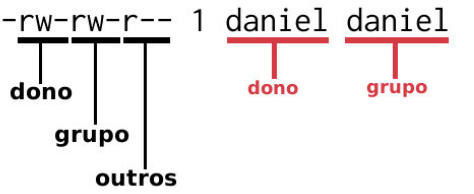

# Administração de usuários

Linux é um sistema de multiusuários que funciona de forma organizada graças
ao **Esquema de permissões** [**leitura**, **escrita** e **execução**].

## User administrador e sudo

Chamado de root. Responsável pro controlar todo o sistema e não possui
restrições

**sudo** usamos sempre que precisamos executar comandos que necessitam do
superUser

## System user

Não necessitam de senhas para logar no sistema. Controlam serviços. Exemplo
como user www-data.

## Common users

Contas criadas para utilização do sistema. Podendo editar documentos, navegar
na internet, etc...

## Permissões

Existem 3 tipos de permissões

- **r** leitura
- **x** execução
- **w** escrita

Comando para listar dados de forma detalhada, inclui as permissões.

```shell
ls -l #[long listing]
```

- **-** significa permissão 'desabilitada' ou negada

Aplicação de permissões está ligada a 3 entidades

- u: user owner do arquivo
- g: grupo a qual pertence
- o: outros users que não sejam o dono ou não pertençam ao grupo

O primeiro caractere indica se é um diretório, link ou arquivo.



## Atribuindo permissões

**chmdo** comando para atribuir permissões, atuando diretamente nos níveis de dono, grupo e outros

Pode ser representado de forma simbólica ou octal.
params:

- "-c" lista infos sobre o arquivo modificado
- "-f" ignora mensagens de erro
- "-R" modo recursivo(altera do dir e subDirs)
- "-v" lista detalhe das alterações

Podemos realizar mudanças nas permissões de várias formas.

Adiciona permissão de leitura e escrita para dono, grupo, outros
Obs: sem espaço após a virgúla.
```shell
sudo chmod u=rw,g=rw,o=rw archive
```
r,w,x

| BIN | OCTA |
|-----|------|
| 000 | 0    |
| 001 | 1    |
| 010 | 2    |
| 011 | 3    |
| 100 | 4    |
| 101 | 5    |
| 110 | 6    |

Adiciona a mesma permissão utilizando notação OCTAL
```shell
sudo chmod 666 archive #110=6,110=6,110=6 -rw-rw-rw-
```

## Criando grupos

Adiciona novo grupo
```shell
sudo addgroup group_name
```

Adicionando novo user
cria um user e group automaticamente
```shell
sudo adduser user_name
```

mostra o id de usuário e de grupo do user
```shell
id user_name
```

Adiciona user ao group se o group não existe ele é criado
```shell
sudo add group user group
```

mostra o group do user
```shell
groups user
```

Cria user e ja o adiciona a um group(group precisa pre-existir)
```shell
adduser user group
```

muda o grupo do arquivo ou dir
```shell
sudo chgrp group archive_or_dir
```

muda o dono do arquivo ou dir
```shell
sudo chown user archive_or_dir
```

deleta group
```shell
sudo groudel group
```

deleta user
```shell
sudo userdel user
```


